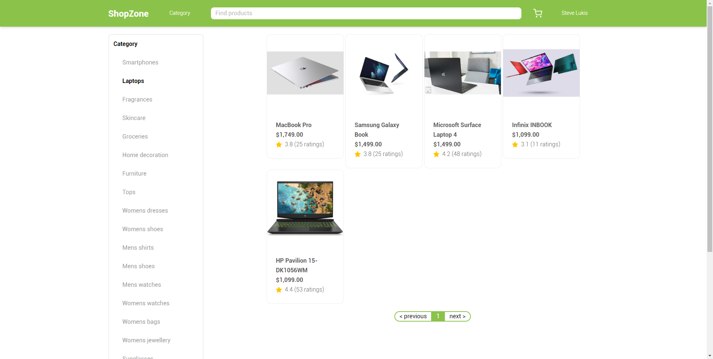
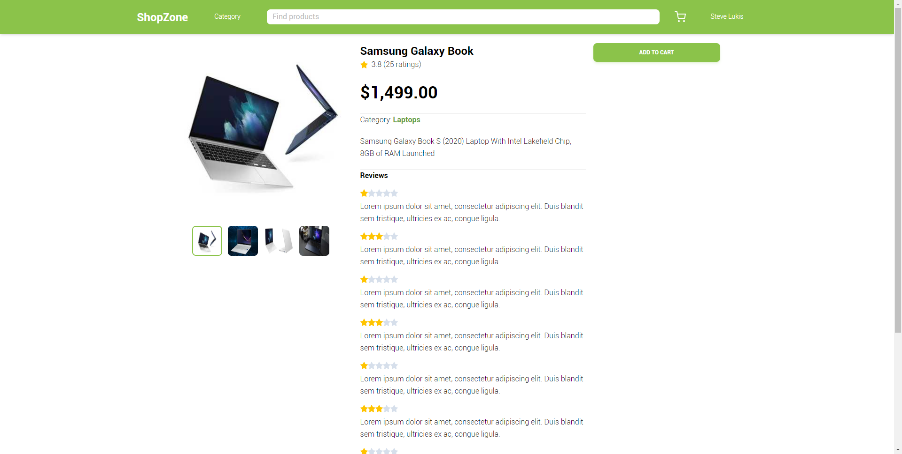
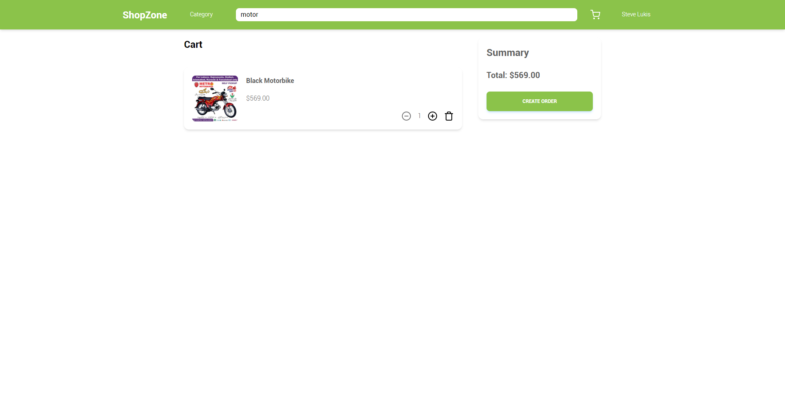
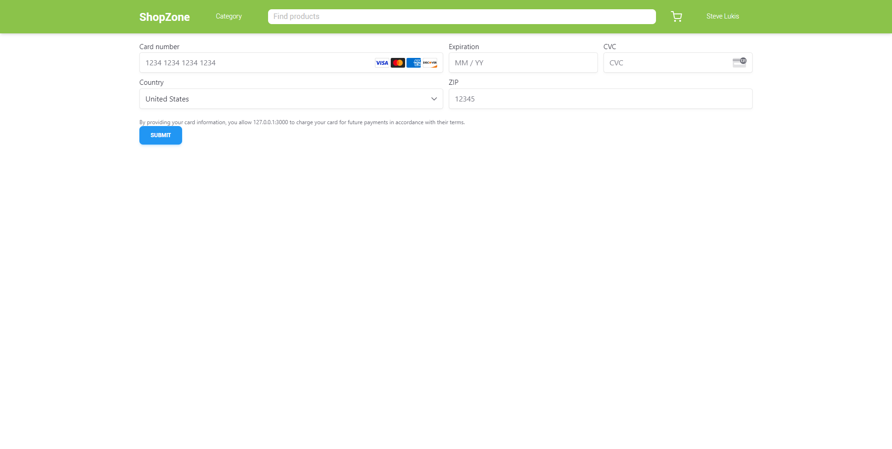
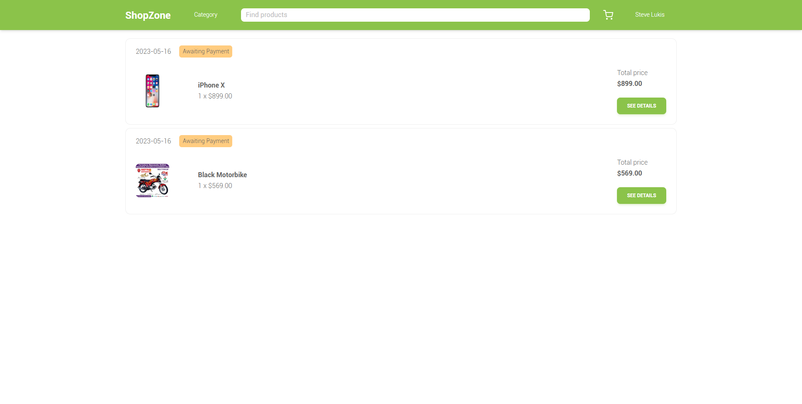

# ShopZone
ShopZone is an ecommerce app that allows users to browse, buy and sell products online. It is built with Django, a Python web framework, and React, a JavaScript library for creating user interfaces.

### Screenshots

