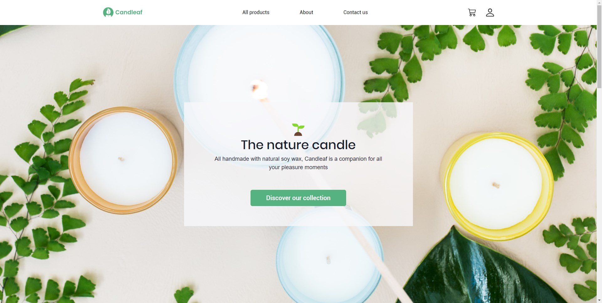

# Candleaf Clone: Online Shop built with Django and React

## Overview

Candleaf-clone is an online shop selling exquisite soy candles inspired by the original Candleaf website.
The backend is built with Django and the frontend is built with React and Typescript.

## Features

- User authentication: Users can create accounts, log in, and log out to access personalized features.
- Product listing: Display a wide range of soy candle products with details such as title, price, and description.
- Product search and filtering: Easily search for specific products and filter them based on various criteria.
- Cart functionality: Users can add products to their cart, update quantities, and proceed to checkout.
- Order management: Admins can manage and process customer orders, update order statuses, and generate invoices.
- Payment integration: Seamlessly integrate payment processing for a smooth checkout experience.
- User reviews and ratings: Users can leave reviews and ratings for products they have purchased.
- Responsive design: Ensure optimal user experience across devices, from desktop to mobile.

## Preview

[You can check the live preview here](https://candleaf.stevelukis.dev/).

```
(The preview uses mock server instead of a live Django server,
so some functionalities are limited)
```




## Installation

- Clone the repository.

```
git clone https://github.com/stevelukis/candleaf
```

- Navigate to the backend directory.

```
cd candleaf/backend
```

- Create a Python virtual environment for the backend.

```
python -m venv venv
```

- Activate the virtual environment.

```
cd venv/Scripts
activate
cd ../..
```

- Install the dependencies for the backend.

```
pip install -r requirements.txt
```

- Create an environment file `.env` for the Stripe keys.

```
STRIPE_PUBLISHABLE_KEY=***your stripe publishable key***
STRIPE_SECRET_KEY=***your secret key***
STRIPE_WEBHOOK_SECRET=***your webhook secret***
```

- Run the migrations

```
python manage.py migrate
```

- Populate the products

```
python dev/populate_products.py
```

- Start the backend server

```
python manage.py runserver
```

- In a separate terminal, navigate to the frontend directory.

```
cd candleaf/frontend
```

- Install frontend dependencies.

```
pnpm install
```

Start the frontend server

```
npm run start
```

## Technologies Used

- Django
- Django REST framework
- social-auth-app-django
- pytest
- Stripe
- React
- Typescript
- Axios
- React Query
- Chakra-UI
- Mock Service Worker

## Contributions

Contributions to this project are welcome! If you find any issues or have suggestions for improvements, feel free to
open a new issue or submit a pull request.
License

## License

This project is licensed under the MIT License.

## Acknowledgments

- [The Candleaf website for inspiring this project and serving as a reference.](https://shopcandleleaf.com/)
- [Figma E-Commerce UI KIT by Uxbly.](https://www.figma.com/community/file/999496395784541518)
